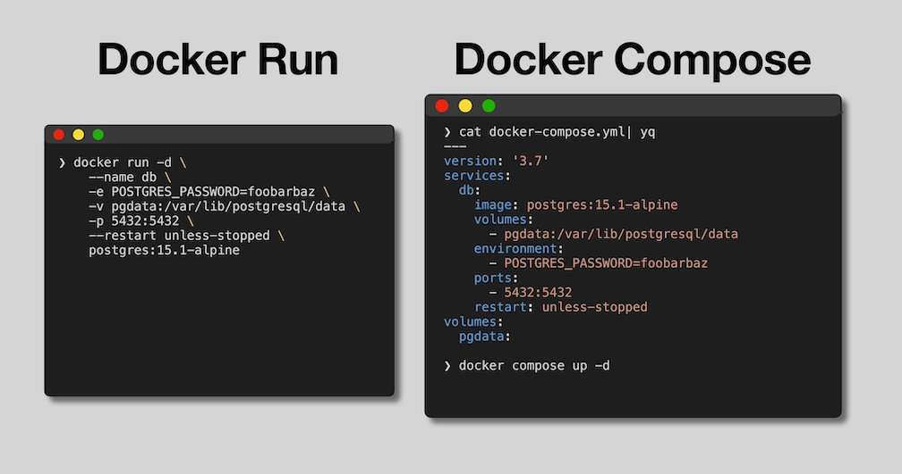

# Important Configuration Options

-d (detach, runs in the background)
```bash
docker run ubuntu sleep 5
docker run -d ubuntu sleep 5 
docker ps
```
--entrypoint
```bash
docker run --entrypoint echo ubuntu hello #the ubuntu doesn't have an entry point by default
```
--env, -e, --env-file
```bash
docker run --env MY_ENV=hello ubuntu printenv #sets environment variables at runtime
```
--init
```bash
   #Running programs in a container defaults PID=1, init makes the process a subprocess
   docker run ubuntu ps
   docker run --init ubuntu ps
```
--interactive, -i
```bash
docker run ubuntu #bash exits immediately
docker run -it ubuntu #shell session within the container
```
--mount, --volume, -v 
--name
```bash
#docker assignes random name if --name is not set, setting
#name is useful for quick logs access
docker container rm my_container
docker run -d --name my_container ubuntu sleep 5
docker logs my_container

```
--network, --net
```bash
# connect to specific network to isolate application
docker network ls
docker network create my_network 
docker run -d --network my_network ubuntu sleep 5
docker container inspect [container_id]

```
--publish, -p
```bash
# connect a port from the host system to the container
```
--restart
```bash
docker run --restart unless_stopped ubuntu
watch "docker ps"
```
--rm
```bash
# removes the container after the exit
```


# Running Containers (with Docker)

There are two primary ways to run docker containers, with `docker run` and `docker compose up`. 



Docker run takes a single container image and runs a container based on it, while docker compose takes a specification of 1 or more services and can build container images for them and/or run containers from those images.

Generally `docker run` is preferable for one off quick use cases, while docker compose is preferable if you are developing a containerized application with more than one service.

## individual docker run commands

The portion of the Makefile labeled `### DOCKER CLI COMMANDS` shows the commands can would use to build and run all of these services. To build the images and then run them you can execute:

```bash
make docker-build-all
make docker-run-all
```

You will notice that each of the run commands has a bunch of options used to ensure the configuration works properly.

- Uses the default docker bridge network
- Publishing ports (`-p` option) useful to connect to each service individually from host, but only necessary to connect to the frontend
- Named containers make it easier to reference (e.g. with link), but does require removing them to avoid naming conflict
- Restart policy allows docker to restart the container (for example if database weren't up yet causing one of the api servers to crash)

## docker compose
https://www.composerize.com/
Using docker compose allows encoding all of the logic from the `docker build` and `docker run` commands into a single file. Docker compose also manages naming of the container images and containers, attaching to logs from all the containers at runtime, etc...

The `docker-compose.yml` file and the portion of the Makefile labeled `### DOCKER COMPOSE COMMANDS` shows how you can use docker compose to build and run the services. To build and run them you can execute

```bash
make compose-up-build
```

As you can see, this is much simpler than needing to execute all of the individual build/run commands and provides a clear way to specify the entire application stack in a single file!

