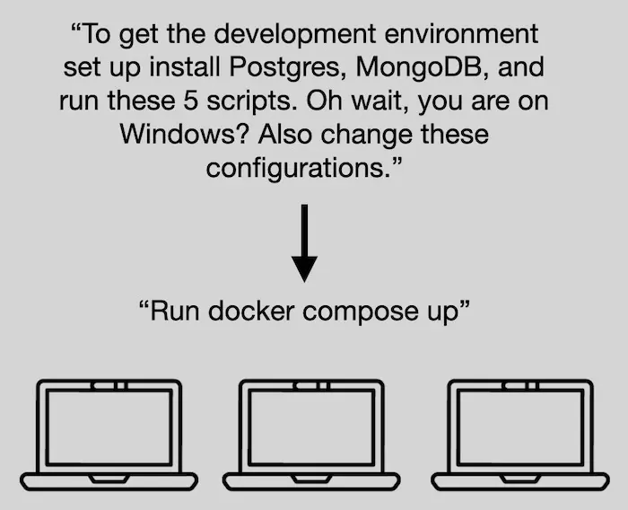
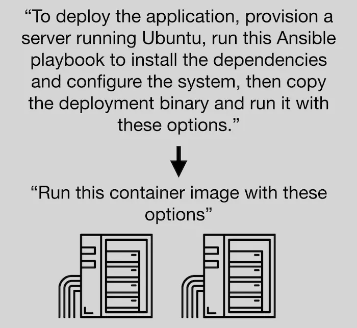

# Why Docker?

## [01 - What is a container?](01-history-and-motivation/README.md)

## [02 - Technology Overview](02-technology-overview/README.md)

Explores the three core Linux features that enable containers to function (cgroups, namespaces, and union filesystems)

## [03 - Using 3rd Party Containers](03-using-3rd-party-containers/README.md)

Before we build our own container images, we can familiarize ourselves with the technology by using publicly available container images. This section covers the nuances of data persistence with containers and then highlights some key use cases for using public container images.

## [04 - Building Container Images](04-building-container-images/README.md)

Demonstrates how to write Dockerfiles and build container images for the components of the example web app. Starting with a naive implementation, we then iterate towards a production ready container image.

<!-- ## [06 - Container Registries](07-container-registries/README.md)

Explains what container registries are and how to use them to share and distribute container images.

## [07 - Running Containers](08-running-containers/README.md)

Using the containerized web application from sections 05 and 06, we craft the necessary commands to run our application with Docker and Docker Compose. We also cover the variety of runtime configuration options and when to use them.

## [08 - Container Security](09-container-security/README.md)

Highlights best practices for container image and container runtime security.

## [9 - Interacting with Docker Objects](10-interacting-with-docker-objects/README.md)

Describes how to use Docker to interact with containers, container images, volumes, and networks.

## [10 - Development Workflows](11-development-workflow/README.md)

Establishes tooling and configuration to enable improved developer experience when working with containers.

## [11 - Deploying Containers](12-deploying-containers/README.md)

Demonstrates deploying container applications to production using three different approaches: railway.app, a single node Docker Swarm, and a Kubernetes cluster. -->
